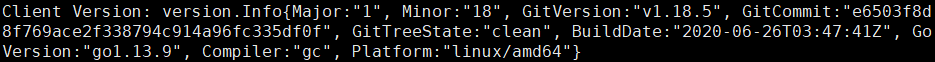
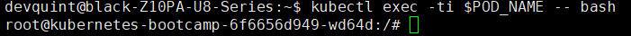

# Kubernetes 기본 설치

# 사전 도구 설치

## kubectl 설치

[kubectl 설치 및 설정](https://kubernetes.io/ko/docs/tasks/tools/install-kubectl/)

쿠버네티스 커맨드 라인 도구

```bash
curl -LO https://storage.googleapis.com/kubernetes-release/release/`curl -s https://storage.googleapis.com/kubernetes-release/release/stable.txt`/bin/linux/amd64/kubectl
chmod +x ./kubectl
sudo mv ./kubectl /usr/local/bin/kubectl
```

### 설치 확인

```bash
kubectl version --client
```



## Docker 설치

```bash
curl -fsSL https://get.docker.com/ | sudo sh
```

### 설치 확인

```bash
docker version
```

> Client: Docker Engine - Community
Version: 19.03.12
API version: 1.40
Go version: go1.13.10
Git commit: 48a66213fe
Built: Mon Jun 22 15:45:44 2020
OS/Arch: linux/amd64
Experimental: false
Got permission denied while

## Minikube 설치

[Minikube 설치](https://kubernetes.io/ko/docs/tasks/tools/install-minikube/)

```bash
curl -Lo minikube https://storage.googleapis.com/minikube/releases/latest/minikube-linux-amd64 \
chmod +x minikube
sudo mkdir -p /usr/local/bin/
sudo install minikube /usr/local/bin/

```

### Minikube 테스트

docker 권한 설정

```bash
sudo usermod -aG docker $USER && newgrp docker
```

minikube 시작

```bash
minikube start
```

(자동으로 docker 선택, 혹은 `minikube start --driver=docker`, 도커 없이 하려면 `minikube start --driver=none`이지만 sudo로 실행해야 할 수 있음)

[Installing Kubernetes with Minikube](https://kubernetes.io/docs/setup/learning-environment/minikube/#specifying-the-vm-driver)

처음 실행 시 쿠버네티스 다운 후 설정에 시간이 걸리는 듯

도커 컨테이너 설정되며 실행

```bash
minikube status
```

> minikube
type: Control Plane
host: Running
kubelet: Running
apiserver: Running
kubeconfig: Configured

```bash
minikube stop
```

설정 제거

```bash
minikube delete
```

> * Deleting "minikube" in docker ...
* Deleting container "minikube" ...
* Removing /home/devquint/.minikube/machines/minikube ...
* Removed all traces of the "minikube" cluster.

상태 확인

```bash
minikube status
```

> * There is no local cluster named "minikube"
- To fix this, run: "minikube start"

# 구동

## 클러스터 시작

### minikube 가동

```bash
minikube start
```

### kubectl 확인

주의! 위에 minikube start하고 바로 하면 나오지 않을 수 있음

```bash
kubectl get nodes
```

> NAME STATUS ROLES AGE VERSION
minikube Ready master 19m v1.18.3

```bash
kubectl cluster-info
```

> Kubernetes master is running at [https://172.17.0.3:8443](https://172.17.0.3:8443/)
KubeDNS is running at [https://172.17.0.3:8443/api/v1/namespaces/kube-system/services/kube-dns:dns/proxy](https://172.17.0.3:8443/api/v1/namespaces/kube-system/services/kube-dns:dns/proxy)

## deploy

```bash
kubectl create deployment kubernetes-bootcamp --image=gcr.io/google-samples/kubernetes-bootcam새ㅔp:v1
```

`kubectl create deployment <...>`

```bash
kubectl get deployments
```

> NAME READY UP-TO-DATE AVAILABLE AGE
kubernetes-bootcamp 1/1 1 1 42s

다른 하나의 보조용 쉘에서

```bash
kubectl proxy
```

입력 후 대기

```bash
curl http://localhost:8001/version
```

> {
"major": "1",
"minor": "18",
"gitVersion": "v1.18.3",
"gitCommit": "2e7996e3e2712684bc73f0dec0200d64eec7fe40",
"gitTreeState": "clean",
"buildDate": "2020-05-20T12:43:34Z",
"goVersion": "go1.13.9",
"compiler": "gc",
"platform": "linux/amd64"
}

### pods 확인

```bash
kubectl get pods
```

> NAME READY STATUS RESTARTS AGE
kubernetes-bootcamp-6f6656d949-wd64d 1/1 Running 0 12m

```bash
kubectl describe pods
```

- 결과

    > Name: kubernetes-bootcamp-6f6656d949-wd64d
    Namespace: default
    Priority: 0
    Node: minikube/~~xxx.xxx.xxx.xxx~~
    Start Time: Fri, 03 Jul 2020 15:18:28 +0900
    Labels: app=kubernetes-bootcamp
    pod-template-hash=6f6656d949
    Annotations: <none>
    Status: Running
    IP: ~~xxx.xxx.xxx.xxx~~
    IPs:
    IP: ~~xxx.xxx.xxx.xxx~~
    Controlled By: ReplicaSet/kubernetes-bootcamp-6f6656d949
    Containers:
    kubernetes-bootcamp:
    Container ID: docker://c6ed53f758eb9bb42c50c5dab2c715ff235194deaa5a57e945fa27551a755090
    Image: [gcr.io/google-samples/kubernetes-bootcamp:v1](http://gcr.io/google-samples/kubernetes-bootcamp:v1)
    Image ID: docker-pullable://gcr.io/google-samples/kubernetes-bootcamp@sha256:0d6b8ee63bb57c5f5b6156f446b3bc3b3c143d233037f3a2f00e279c8fcc64af
    Port: <none>
    Host Port: <none>
    State: Running
    Started: Fri, 03 Jul 2020 15:18:42 +0900
    Ready: True
    Restart Count: 0
    Environment: <none>
    Mounts:
    /var/run/secrets/kubernetes.io/serviceaccount from default-token-cfwlv (ro)
    Conditions:
    Type Status
    Initialized True
    Ready True
    ContainersReady True
    PodScheduled True
    Volumes:
    default-token-cfwlv:
    Type: Secret (a volume populated by a Secret)
    SecretName: default-token-cfwlv
    Optional: false
    QoS Class: BestEffort
    Node-Selectors: <none>
    Tolerations: [node.kubernetes.io/not-ready:NoExecute](http://node.kubernetes.io/not-ready:NoExecute) for 300s
    [node.kubernetes.io/unreachable:NoExecute](http://node.kubernetes.io/unreachable:NoExecute) for 300s
    Events:
    Type Reason Age From Message
    ---- ------ ---- ---- -------
    Normal Scheduled 13m default-scheduler Successfully assigned default/kubernetes-bootcamp-6f6656d949-wd64d to minikube
    Normal Pulling 13m kubelet, minikube Pulling image "[gcr.io/google-samples/kubernetes-bootcamp:v1](http://gcr.io/google-samples/kubernetes-bootcamp:v1)"
    Normal Pulled 13m kubelet, minikube Successfully pulled image "[gcr.io/google-samples/kubernetes-bootcamp:v1](http://gcr.io/google-samples/kubernetes-bootcamp:v1)"
    Normal Created 13m kubelet, minikube Created container kubernetes-bootcamp
    Normal Started 13m kubelet, minikube Started container kubernetes-bootcamp

상술한 `kubectl proxy` 가 다른 쉘에서 실행중인 상태에서 

```bash
export POD_NAME=$(kubectl get pods -o go-template --template '{{range .items}}{{.metadata.name}}{{"\n"}}{{end}}')
curl http://localhost:8001/api/v1/namespaces/default/pods/$POD_NAME/proxy/
```

라고 했는데 실제로 저대로 curl시에 `Error trying to reach service: 'dial tcp 172.18.0.4:80: connect: connection refused` 라고 나옴. 이 경우에 curl에서 POD_NAME 뒤에 :8080을 붙이면 해결된다는 [이야기](https://github.com/kubernetes/website/issues/18079#issuecomment-566720495)가 있어서 해 보니 됨. 따라서 curl만 다시

```bash
curl http://localhost:8001/api/v1/namespaces/default/pods/$POD_NAME:8080/proxy/
```

> Hello Kubernetes bootcamp! | Running on: kubernetes-bootcamp-6f6656d949-wd64d | v=1

이후 로그

```bash
kubectl logs $POD_NAME
```

> Kubernetes Bootcamp App Started At: 2020-07-03T06:18:42.409Z | Running On: kubernetes-bootcamp-6f6656d949-wd64d
Running On: kubernetes-bootcamp-6f6656d949-wd64d | Total Requests: 1 | App Uptime: 1583.213 seconds | Log Time: 2020-07-03T06:45:05.622Z
Running On: kubernetes-bootcamp-6f6656d949-wd64d | Total Requests: 2 | App Uptime: 1695.112 seconds | Log Time: 2020-07-03T06:46:57.521Z

환경변수 확인

```bash
kubectl exec $POD_NAME -- env
```

왜인지 모르겠지만 `--env`가 아니라 `-- env` , 구버전 커맨드로 `--` 없이 `kubectl exec <pod> env`도 있지만 조만간 불가능해질 것이라고 함

> PATH=/usr/local/sbin:/usr/local/bin:/usr/sbin:/usr/bin:/sbin:/bin
HOSTNAME=kubernetes-bootcamp-6f6656d949-wd64d
KUBERNETES_SERVICE_PORT=443
KUBERNETES_SERVICE_PORT_HTTPS=443
KUBERNETES_PORT=tcp://10.96.0.1:443
KUBERNETES_PORT_443_TCP=tcp://xxx.xxx.xxx.xxx:443
KUBERNETES_PORT_443_TCP_PROTO=tcp
KUBERNETES_PORT_443_TCP_PORT=443
KUBERNETES_PORT_443_TCP_ADDR=xxx.xxx.xxx.xxx
KUBERNETES_SERVICE_HOST=xxx.xxx.xxx.xxx
NPM_CONFIG_LOGLEVEL=info
NODE_VERSION=6.3.1
HOME=/root

### pod 진입

```bash
kubectl exec -ti $POD_NAME -- bash
```

상술한 대로 지금은 `--` 없이 가능

이후에는 pod 내의 쉘로 진입함 



그래서 제공해준 이미지에 금방 curl로 응답받은 메세지를 응답해주는 코드가 있는 모양, `server.js`

따라서 진입한 쉘에서

- pod 내부

    ```bash
    cat server.js
    ```

를 입력하면 코드가 보임

- 결과

    > var http = require('http');
    var requests=0;
    var podname= process.env.HOSTNAME;
    var startTime;
    var host;
    var handleRequest = function(request, response) {
    response.setHeader('Content-Type', 'text/plain');
    response.writeHead(200);
    response.write("Hello Kubernetes bootcamp! | Running on: ");
    response.write(host);
    response.end(" | v=1\n");
    console.log("Running On:" ,host, "| Total Requests:", ++requests,"| App Uptime:", (new Date() - startTime)/1000 , "seconds", "| Log Time:",new Date());
    }
    var www = http.createServer(handleRequest);
    www.listen(8080,function () {
    startTime = new Date();;
    host = process.env.HOSTNAME;
    console.log ("Kubernetes Bootcamp App Started At:",startTime, "| Running On: " ,host, "\n" );
    });

이제 여기서는 실제로 서버가 돌아가는데는 localhost니까 별도의 무언가 없이 localhost로 curl이 가능한 듯

- pod 내부

    ```bash
    curl localhost:8080
    ```

> Hello Kubernetes bootcamp! | Running on: kubernetes-bootcamp-6f6656d949-wd64d | v=1

당연히 나가려면 `exit`