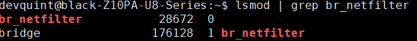
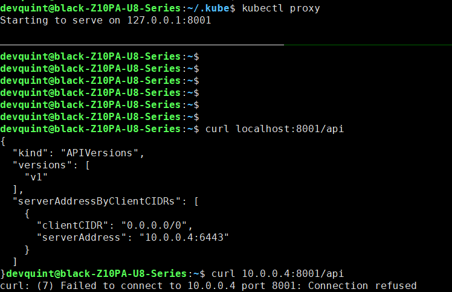
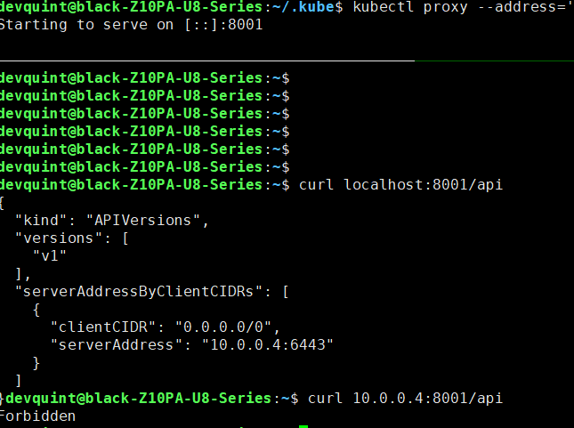
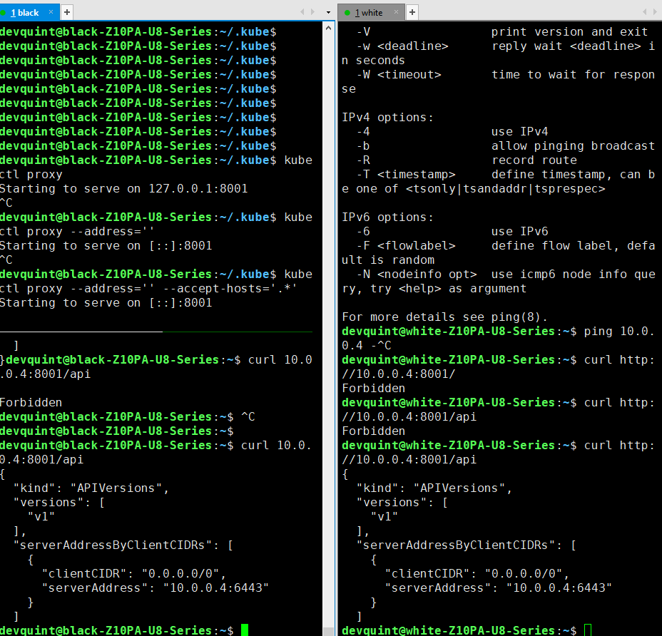
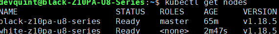
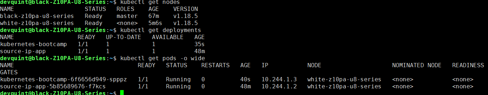
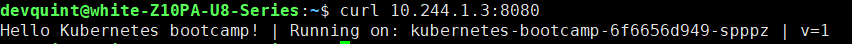

# Kubernetes 워커/마스터 설정


# 추가 사전 준비

## kubeadm, kubelet, kubectl

[Installing kubeadm](https://kubernetes.io/docs/setup/production-environment/tools/kubeadm/install-kubeadm/)

```bash
cat <<EOF | sudo tee /etc/sysctl.d/k8s.conf
net.bridge.bridge-nf-call-ip6tables = 1
net.bridge.bridge-nf-call-iptables = 1
EOF
sudo sysctl --system

```

하고 확인

```bash
lsmod | grep br_netfilter
```



```bash
sudo apt-get update && sudo apt-get install -y apt-transport-https curl
curl -s https://packages.cloud.google.com/apt/doc/apt-key.gpg | sudo apt-key add -
cat <<EOF | sudo tee /etc/apt/sources.list.d/kubernetes.list
deb https://apt.kubernetes.io/ kubernetes-xenial main
EOF
sudo apt-get update
sudo apt-get install -y kubelet kubeadm kubectl
sudo apt-mark hold kubelet kubeadm kubectl

```

이후 kubeadm 버전 확인

```bash
kubeadm version
```

> kubeadm version: &[version.Info](http://version.info/){Major:"1", Minor:"18", GitVersion:"v1.18.5", GitCommit:"e6503f8d8f769ace2f338794c914a96fc335df0f", GitTreeState:"clean", BuildDate:"2020-06-26T03:45:16Z", GoVersion:"go1.13.9", Compiler:"gc", Platform:"linux/amd64"}

kubectl 중복 설치 문제가 있을 수 있을 것 같은데 일단은 문제없이 동작하였음.

이후 `kubectl version` 시에 cubeadm 등 정보도 같이 나오는 모양

- 결과

    kubeadm version: &[version.Info](http://version.info/){Major:"1", Minor:"18", GitVersion:"v1.18.5", GitCommit:"e6503f8d8f769ace2f338794c914a96fc335df0f", GitTreeState:"clean", BuildDate:"2020-06-26T03:45:16Z", GoVersion:"go1.13.9", Compiler:"gc", Platform:"linux/amd64"}
    devquint@black-Z10PA-U8-Series:~$ kubectl version
    Client Version: [version.Info](http://version.info/){Major:"1", Minor:"18", GitVersion:"v1.18.5", GitCommit:"e6503f8d8f769ace2f338794c914a96fc335df0f", GitTreeState:"clean", BuildDate:"2020-06-26T03:47:41Z", GoVersion:"go1.13.9", Compiler:"gc", Platform:"linux/amd64"}
    Server Version: [version.Info](http://version.info/){Major:"1", Minor:"18", GitVersion:"v1.18.3", GitCommit:"2e7996e3e2712684bc73f0dec0200d64eec7fe40", GitTreeState:"clean", BuildDate:"2020-05-20T12:43:34Z", GoVersion:"go1.13.9", Compiler:"gc", Platform:"linux/amd64"}

# 시작

[쿠버네티스(Kubernetes) 설치 및 환경 구성하기](https://medium.com/finda-tech/overview-8d169b2a54ff)

## 스왑 메모리 비활성화

이 글에서 하라고 했는데 1월 8일 글이므로 해당 부분이 문제를 일으킬 수 있을 수도 있음. 일단 해봄... 

권한이 필요할 경우 알아서

```bash
swapoff -a
sed -i '2s/^/#/' /etc/fstab
```

## Docker 드라이버 교체

```bash
sudo cat > /etc/docker/daemon.json <<EOF
{
  "exec-opts": ["native.cgroupdriver=systemd"],
  "log-driver": "json-file",
  "log-opts": {
    "max-size": "100m"
  },
  "storage-driver": "overlay2"
}
EOF
sudo mkdir -p /etc/systemd/system/docker.service.d
sudo systemctl daemon-reload
sudo systemctl restart docker
```

## Pod 네트워크 애드온 설치

10G 네트워크로 연결되어 있음.

기본적으로 kubenet를 사용할 수 있다고 하는데, 일단 게시글에서 시키는 대로 해 봄

Flannel을 사용하고, `kubeadm init` 시에 `--pod-network-cidr=<ip>` 를 인자로 추가해 주면 됨. 이 때 Flannel에서 기본 네트워크 대역은 `10.244.0.0/16` 을 권장하고 있다고 함. 실제로 사용해도 되는지 확인은 나중에 할 예정.

또한 특정 값을 설정해주어야 CNI 플러그인이 동작할 수 있다고 함

```bash
sudo sysctl net.bridge.bridge-nf-call-iptables=1
```

## 마스터 노드 설정

### API Server 주소 설정

컨트롤 플레인 역할을 할 것임을 kubeadm에 전달해 주어야 함

스스로의 IPv4값 = black의 10G ip인 `10.0.0.4` 를 사용하면 될 것이고, `kubeadm init` 시에 `--apiserver-advertise-address` 인자로 전달하면 된다고 함

### 마스터 노드 생성과 실행

```bash
sudo kubeadm init --pod-network-cidr=10.244.0.0/16 --apiserver-advertise-address=10.0.0.4
```

- 실행결과

    > devquint@black-Z10PA-U8-Series:~$ sudo kubeadm init --pod-network-cidr=10.244.0.0/16 --apiserver-advertise-address=10.0.0.4
    W0706 14:45:33.487943 1882529 configset.go:202] WARNING: kubeadm cannot validate component configs for API groups [[kubelet.config.k8s.io](http://kubelet.config.k8s.io/) [kubeproxy.config.k8s.io](http://kubeproxy.config.k8s.io/)]
    [init] Using Kubernetes version: v1.18.5
    [preflight] Running pre-flight checks
    [WARNING IsDockerSystemdCheck]: detected "cgroupfs" as the Docker cgroup driver. The recommended driver is "systemd". Please follow the guide at [https://kubernetes.io/docs/setup/cri/](https://kubernetes.io/docs/setup/cri/)
    [preflight] Pulling images required for setting up a Kubernetes cluster
    [preflight] This might take a minute or two, depending on the speed of your internet connection
    [preflight] You can also perform this action in beforehand using 'kubeadm config images pull'
    [kubelet-start] Writing kubelet environment file with flags to file "/var/lib/kubelet/kubeadm-flags.env"
    [kubelet-start] Writing kubelet configuration to file "/var/lib/kubelet/config.yaml"
    [kubelet-start] Starting the kubelet
    [certs] Using certificateDir folder "/etc/kubernetes/pki"
    [certs] Generating "ca" certificate and key
    [certs] Generating "apiserver" certificate and key
    [certs] apiserver serving cert is signed for DNS names [black-z10pa-u8-series kubernetes kubernetes.default kubernetes.default.svc kubernetes.default.svc.cluster.local] and IPs [10.96.0.1 10.0.0.4]
    [certs] Generating "apiserver-kubelet-client" certificate and key
    [certs] Generating "front-proxy-ca" certificate and key
    [certs] Generating "front-proxy-client" certificate and key
    [certs] Generating "etcd/ca" certificate and key
    [certs] Generating "etcd/server" certificate and key
    [certs] etcd/server serving cert is signed for DNS names [black-z10pa-u8-series localhost] and IPs [10.0.0.4 127.0.0.1 ::1]
    [certs] Generating "etcd/peer" certificate and key
    [certs] etcd/peer serving cert is signed for DNS names [black-z10pa-u8-series localhost] and IPs [10.0.0.4 127.0.0.1 ::1]
    [certs] Generating "etcd/healthcheck-client" certificate and key
    [certs] Generating "apiserver-etcd-client" certificate and key
    [certs] Generating "sa" key and public key
    [kubeconfig] Using kubeconfig folder "/etc/kubernetes"
    [kubeconfig] Writing "admin.conf" kubeconfig file
    [kubeconfig] Writing "kubelet.conf" kubeconfig file
    [kubeconfig] Writing "controller-manager.conf" kubeconfig file
    [kubeconfig] Writing "scheduler.conf" kubeconfig file
    [control-plane] Using manifest folder "/etc/kubernetes/manifests"
    [control-plane] Creating static Pod manifest for "kube-apiserver"
    [control-plane] Creating static Pod manifest for "kube-controller-manager"
    W0706 14:46:04.443244 1882529 manifests.go:225] the default kube-apiserver authorization-mode is "Node,RBAC"; using "Node,RBAC"
    [control-plane] Creating static Pod manifest for "kube-scheduler"
    W0706 14:46:04.446036 1882529 manifests.go:225] the default kube-apiserver authorization-mode is "Node,RBAC"; using "Node,RBAC"
    [etcd] Creating static Pod manifest for local etcd in "/etc/kubernetes/manifests"
    [wait-control-plane] Waiting for the kubelet to boot up the control plane as static Pods from directory "/etc/kubernetes/manifests". This can take up to 4m0s
    [apiclient] All control plane components are healthy after 23.002827 seconds
    [upload-config] Storing the configuration used in ConfigMap "kubeadm-config" in the "kube-system" Namespace
    [kubelet] Creating a ConfigMap "kubelet-config-1.18" in namespace kube-system with the configuration for the kubelets in the cluster
    [upload-certs] Skipping phase. Please see --upload-certs
    [mark-control-plane] Marking the node black-z10pa-u8-series as control-plane by adding the label "[node-role.kubernetes.io/master=](http://node-role.kubernetes.io/master=)''"
    [mark-control-plane] Marking the node black-z10pa-u8-series as control-plane by adding the taints [[node-role.kubernetes.io/master:NoSchedule](http://node-role.kubernetes.io/master:NoSchedule)]
    [bootstrap-token] Using token: 00wfkv.0utgwhhrkng75awr
    [bootstrap-token] Configuring bootstrap tokens, cluster-info ConfigMap, RBAC Roles
    [bootstrap-token] configured RBAC rules to allow Node Bootstrap tokens to get nodes
    [bootstrap-token] configured RBAC rules to allow Node Bootstrap tokens to post CSRs in order for nodes to get long term certificate credentials
    [bootstrap-token] configured RBAC rules to allow the csrapprover controller automatically approve CSRs from a Node Bootstrap Token
    [bootstrap-token] configured RBAC rules to allow certificate rotation for all node client certificates in the cluster
    [bootstrap-token] Creating the "cluster-info" ConfigMap in the "kube-public" namespace
    [kubelet-finalize] Updating "/etc/kubernetes/kubelet.conf" to point to a rotatable kubelet client certificate and key
    [addons] Applied essential addon: CoreDNS
    [addons] Applied essential addon: kube-proxy
    Your Kubernetes control-plane has initialized successfully!
    To start using your cluster, you need to run the following as a regular user:
    mkdir -p $HOME/.kube
    sudo cp -i /etc/kubernetes/admin.conf $HOME/.kube/config
    sudo chown $(id -u):$(id -g) $HOME/.kube/config
    You should now deploy a pod network to the cluster.
    Run "kubectl apply -f [podnetwork].yaml" with one of the options listed at:
    [https://kubernetes.io/docs/concepts/cluster-administration/addons/](https://kubernetes.io/docs/concepts/cluster-administration/addons/)
    Then you can join any number of worker nodes by running the following on each as root:
    kubeadm join 10.0.0.4:6443 --token 00wfkv.0utgwhhrkng75awr \
    --discovery-token-ca-cert-hash sha256:1e1dc22ba22be56d91428c675d6cd0479ce4ef476a4f1b25d978f867a16df1d6

요약: `Your Kubernetes control-plane has initialized successfully!`

### 클러스터 사용 설정

```bash
mkdir -p $HOME/.kube
sudo cp -i /etc/kubernetes/admin.conf $HOME/.kube/config
sudo chown $(id -u):$(id -g) $HOME/.kube/config

```

root 계정 이외의 계정에서 kubectl을 사용하기 위함이라고 함

즉 내부 권한파일을 가져온 것(자세하게는 RBAC 뭐라고 하는데 잘 모르겠음)

### Pod 네트워크 Flunnel 설정

- 기나긴 삽질

    ```bash
    kubectl apply -f https://raw.githubusercontent.com/coreos/flannel/master/Documentation/kube-flannel.yml
    ```

    그런데 

    > Unable to connect to the server: dial tcp 172.17.0.3:8443: connect: no route to host

    가 나옴

    ~~그냥 `minikube start`를 해 준 뒤에 하니 해결됨.~~

    결과는

    > podsecuritypolicy.policy/psp.flannel.unprivileged created
    [clusterrole.rbac.authorization.k8s.io/flannel](http://clusterrole.rbac.authorization.k8s.io/flannel) created
    [clusterrolebinding.rbac.authorization.k8s.io/flannel](http://clusterrolebinding.rbac.authorization.k8s.io/flannel) created
    serviceaccount/flannel created
    configmap/kube-flannel-cfg created
    daemonset.apps/kube-flannel-ds-amd64 created
    daemonset.apps/kube-flannel-ds-arm64 created
    daemonset.apps/kube-flannel-ds-arm created
    daemonset.apps/kube-flannel-ds-ppc64le created
    daemonset.apps/kube-flannel-ds-s390x created

    아래처럼 노드 확인 역시 가능

    > devquint@black-Z10PA-U8-Series:~/.kube$ kubectl get nodes
    NAME STATUS ROLES AGE VERSION
    minikube Ready master 3d v1.18.3

    근데 이렇게 하니 뭔가 잘못된 것 같음. 실제로 구동되는건 minikube가 아니라 kubectl이나 어딘가에서 생성된 master노드여야 할 것 같음

    그래서 `sudo kubeadm reset` 으로 쭉 날리고, 이전처럼 minikube 역시 `minikube stop` `minikube delete` 로 날려줌.

    그리고 `./kube/config` 파일 역시 지워주고, [처음](https://www.notion.so/devquint/Kubernetes-e8444382217a431eb9ca354554238d32#e918fe67b97b4d8eb4d1bead7b248eff)부터 다시 함.

    그랬더니 뭐가 문제였었는지는 몰라도 알아서 노드가 생겨 있음... (아까 했을때는 없었음)

    > devquint@black-Z10PA-U8-Series:~/.kube$ kubectl --kubeconfig ~/.kube/config get nodes
    NAME STATUS ROLES AGE VERSION
    black-z10pa-u8-series NotReady master 3m40s v1.18.5

    funnel 설정 역시 뭐 안해줘도 됨... 뭐지...

    아무튼 했으니 funnel 설정 한거 확인했으니 다시 proxy 켜주고, get nodes로 status `Ready`로 바뀐 것 확인 완료.

    그런데 curl으로 접속 확인 시에 `localhost`로는 가능하지만 외부 IPv4 주소(`10.0.0.4`)로 할 경우에 연결이 되지 않음. (connection refused) proxy 시에 `--address=''` 로 ip를 열면 refused 되지는 않지만 curl에서 forbidden이 발생

    

    인자 없이 열었을 경우

    

    인자를 포함해 열었을 경우

    일단 white에서도 연결을 시도했을 때 내부에서 10.0.0.4로 접근했을 때 나오는 상태(인자가 없으면 연결이 안되고 refused, 있으면 Forbidden 수신)가 같으니 아무래도 연결의 문제라기 보다는 kubectl쪽의 문제일 것 같음.

    이 현상은 10G만 그런게 아니라 그냥 내부 네트워크(192.168.x.x)로 접근할 때도 발생함. 결과도 같음.

    근데 문제는 간단했음. 여기 [github의 이슈글 자체](https://github.com/kubernetes/dashboard/issues/2816)에서 보면 `--accept-hosts='.*'` 를 사용하길래 넣었더니 그냥 해결됨. white에서도 접속 확인됨.

    

삽질이 길었으니 접어두고 요약

일단 

```bash
kubectl apply -f https://raw.githubusercontent.com/coreos/flannel/master/Documentation/kube-flannel.yml
```

입력해서 flannel 적용시켜 주고,

```bash
kubectl proxy --address='' --accept-hosts='.*'
```

로 실행시켜 주면 됨. 

이 경우 10G에서 다른 네트워크에서 `curl 10.0.0.4:8001/api`로 연결이 되는 것을 확인함.

근데 이거 그냥 상태 확인하고 그런 것 같은데 굳이 했어야 했나 싶음... 아닌가?

### 끝

일단 아무튼 마스터 노드의 설정은 완료함

## 워크 노드 설정

일단 기본적으로 아직 white에는 아무것도 하지 않았음

고로 처음 

[Kubernetes 기본 설치](https://www.notion.so/Kubernetes-a7dfa9251b0d4379b129418861fe9db9)

부터 뚝딱뚝딱 (kubectl부터는 스킵)

그리고 [이 페이지 위쪽](https://www.notion.so/devquint/Kubernetes-e8444382217a431eb9ca354554238d32#aebd914527a44cf9bcd621daf858bfb3) 역시 뚝딱뚝딱, 마스터 노드 얘기 부분부터 스킵

### 마스터 노드 아이피 확인

[위에서 만들고 나서 보면](https://www.notion.so/devquint/Kubernetes-e8444382217a431eb9ca354554238d32#906c62fe0f65461daded5ef6def4cead) 6443 포트의 아이피가 나올 것

이는 우리가 설정했던 아이피이므로, 여기서는 `10.0.0.4:6443`

그리고 그게 나오는 맨 밑에서 보면 join 뭐로 워크노드 참여시킬 수 있다는 내용이 있을 것. 여기서는 

```bash
kubeadm join 10.0.0.4:6443 --token 00wfkv.0utgwhhrkng75awr \
--discovery-token-ca-cert-hash sha256:1e1dc22ba22be56d91428c675d6cd0479ce4ef476a4f1b25d978f867a16df1d6
```

### join

위의 커맨드 그대로 실행해준다

그런데 안 됨

> devquint@white-Z10PA-U8-Series:~$ kubeadm join 10.0.0.4:6443 --token 00wfkv.0utgwhhrkng75awr \
> --discovery-token-ca-cert-hash sha256:1e1dc22ba22be56d91428c675d6cd0479ce4ef476a4f1b25d978f867a16df1d6
W0706 16:19:53.845839 49457 join.go:346] [preflight] WARNING: JoinControlPane.controlPlane settings will be ignored when control-plane flag is not set.
[preflight] Running pre-flight checks
error execution phase preflight: [preflight] Some fatal errors occurred:
[ERROR IsPrivilegedUser]: user is not running as root
[preflight] If you know what you are doing, you can make a check non-fatal with `--ignore-preflight-errors=...`
To see the stack trace of this error execute with --v=5 or higher

혹시 그 사이에 토큰이 만료되었거나 잘못된 것일 수 있으므로 토큰을 재확인함

### 토큰 확인

`--token`의 인자는

```bash
kubeadm token list
```

만약 위 토큰이 만료되었을 경우는

```bash
kubeadm token create
```

`--discovery-token-ca-cert-hash`의 인자는

```bash
openssl x509 -pubkey -in /etc/kubernetes/pki/ca.crt | openssl rsa -pubin -outform der 2>/dev/null | openssl dgst -sha256 -hex | sed 's/^.* //'
```

로 확인한다고 한다.

다시 확인해서 입력하고, 또 위에 에러메세지 보니까 단순한 권한 문제인 모양.... 아무튼 아래 커맨드로 다시 실행함

```bash
sudo kubeadm join 10.0.0.4:6443 --token dq2qbg.k5bkly5ha7fl8g3o --discovery-token-ca-cert-hash sha256:f3949d81828ac00ef8efc0795a852dc02da0a8b68a61cc392509bd1d35d46a8e
```

- 결과

    > devquint@white-Z10PA-U8-Series:~$ sudo kubeadm join 10.0.0.4:6443 --token dq2qbg.k5bkly5ha7fl8g3o --discovery-token-ca-cert-hash sha256:f3949d81828ac00ef8efc0795a852dc02da0a8b68a61cc392509bd1d35d46a8e
    [sudo] password for devquint:
    W0706 16:31:26.017841 57684 join.go:346] [preflight] WARNING: JoinControlPane.controlPlane settings will be ignored when control-plane flag is not set.
    [preflight] Running pre-flight checks
    [WARNING IsDockerSystemdCheck]: detected "cgroupfs" as the Docker cgroup driver. The recommended driver is "systemd". Please follow the guide at [https://kubernetes.io/docs/setup/cri/](https://kubernetes.io/docs/setup/cri/)
    [preflight] Reading configuration from the cluster...
    [preflight] FYI: You can look at this config file with 'kubectl -n kube-system get cm kubeadm-config -oyaml'
    [kubelet-start] Downloading configuration for the kubelet from the "kubelet-config-1.18" ConfigMap in the kube-system namespace
    [kubelet-start] Writing kubelet configuration to file "/var/lib/kubelet/config.yaml"
    [kubelet-start] Writing kubelet environment file with flags to file "/var/lib/kubelet/kubeadm-flags.env"
    [kubelet-start] Starting the kubelet
    [kubelet-start] Waiting for the kubelet to perform the TLS Bootstrap...
    This node has joined the cluster:
    * Certificate signing request was sent to apiserver and a response was received.
    * The Kubelet was informed of the new secure connection details.
    Run 'kubectl get nodes' on the control-plane to see this node join the cluster.

요약: `This node has joined the cluster:`

## 노드 확인

이제 join이 잘 되었으니, 마스터 노드에서 노드를 확인하자

다시 마스터 노드인 black로 돌아가서...

```bash
kubectl get nodes
```



## deploy

구글의 예시 프로젝트를 deploy 해보자. 당연히 마스터 노드에서 실행.

```bash
kubectl create deployment kubernetes-bootcamp --image=gcr.io/google-samples/kubernetes-bootcamp:v1
```

> deployment.apps/kubernetes-bootcamp created

그리고 여러 커맨드로 상태 확인



이제 워크 노드에서 저기 `10.244.1.3` 으로 접속을 해 보면



잘 되기는 한다

## 그런데...

일단 워크 노드랑 마스터 노드 결합은 마무리한 것 같음

그런데 이게 10G로 연결된 건지는 확인이 필요함. 일단 10G IP 대역이 10.0.0.x이고 그걸로 연결했으니 아마 맞을 것 같지만... 그래도 중간 설정에서 꼬인게 있을 수 있고 하니 확인은 해 보는게 맞을 것 같음. 어떻게 확인하느냐가 문제. 일단 스킵.